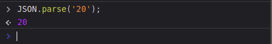
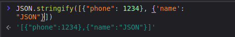
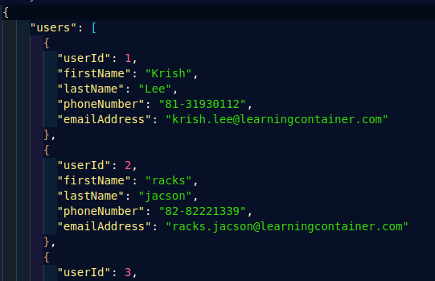
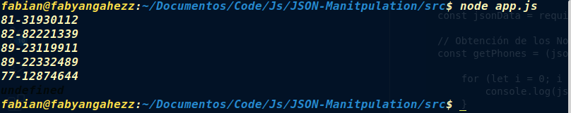

# JSON-Manipulation
*This is a repository to exercise the basics of JSON manipulation

## INDICE
---
* [JSON](#introduction)
* [Estructura](#estrucura)
* [Practica](#practica)

## ¿Que es JSON? <a name='introduction'></a>
JavaScript Object Notation. Un formato de intercambio de información entre aplicaciones.

Esto nos permite serializar objetos, arreglos, números, cadenas, booleanos y nulos.

## Estructura de JSON <a name='estructura'></a>
Es parecido a un objeto literal de JS, pero todas sus claves deben llevar comillas dobles "", (tambien es recomendable ponerlos en los valores):
<br>
```JSON
    {
        "userId": 1,
        "firstName": "Krish",
        "lastName": "Lee",
        "phoneNumber": "123456",
        "emailAddress": "krish.lee@learningcontainer.com"
      }
```

**Dos de los métodos mas importantes** son ***parse()*** y ***stringify()***
* **parse()**
    <br>Convierte el JSON en un formato interno que el lenguaje soporta, por ejemplo:
    
* **stringify()**
<br>Por el contrario este método convierte objeto de JS a cadena de texto JSON:



## Practice <a name='practica'> </a> 
*Para ejemplo cuando ya contamos con un archivo JSON, podemos usar la función *require* para accedera el:*
*app.js*
```JS
    const json = require('./users.json')
```
... 
Obteniendo:<br>
<kbd><kbd>

...

*Contando ya con los datos, podemos realizar distintas operaciones, segun nuestro intereses, por ejemplo si queremos obtener los número telefonicos de los usuarios podemos acceder a ellos como sigue:*
<br>
```JS
const jsonData = require('./users.json');

// Obtención de los No. Telefonicos iterando sobre objeto users:
const getPhones = (json) => {

    for (let i = 0; i < json.users.length; i++) {
        console.log(json.users[i].phoneNumber);
    }
    return
}

console.log(getPhones(jsonData));

```

Siendo el output:


<br>

---
<br>

*En otro ejemplo podemos usar el JSON XNzXri4.json que contiene, el cual contiene objetos anidados en otros objetos y arrays.<br>*
```JS
    const newJson = require('../XNzXr1i4.json');
    console.log(newJson);
```
<br>

```JSON
[
  {
    "destination":[
    "Mediterranean",
    "Carrebean",
    "Bahamas",
    "Europe",
    "Mexico",
    "Alaska",
    "North America",
    "Scandenavia",
    "Pacific",
    "Baltic",
    "Asia Indian Ocean",
    "Hawaii",
    "Australasia",
    "Bermuda",
    "Transatlantic",
    "United Kingdom",
    "Sout America",
    "Canaries",
    ...
    ]
```
*Para obtener por ejemplo todos los estados de los **'primary guest details'**:*
* Primero accedemos al indice del array.
* Accedemos a los objetos anidados por *'dot notation'* 
  
<br>

```JS
// Extracción de datos XNzXr1i4.json
    const newJson = require('../XNzXr1i4.json');

    const states = newJson[2].primary_guest_details.state;
    console.log(states);
```
**output:**
```JSON
    [
        "Alabama",
        "Alaska",
        "Arizona",
        "Arkansas",
        "California",
        "Colorado",
        "Conneticut",
        "Delaware",
        "District of Columbia",
        "Florida",
        "Georgia",
        "Hawaii",
        "Idaho",
        "Illinois",
        "Indiana",
        "Iowa",
        ...
    ]
```
...
---
Para extrar los **destinos**:
* Accemos al primer indice del array
* Seleccionamos el objeto anidado **destination**   
```JS
    const destinations = newJson[1].destination;
    console.log(destinations)
```
**Output**:
```JS
// Se obtiene un array con los datos
[
  'Mediterranean',     
  'Bahamas',           
  'Mexico',            
  'North America',     
  'Pacific',           
  'Asia Indian Ocean', 
  'Australasia',       
  'Transatlantic',     
  'Sout America',      
  'Iberia Peninsula',  
  'Middle East',       
  'Polar Regions',     
  'Russia',            
  'Africa',            
  'Black Sea',         
  'Fiji',              
  'Oceania',
  ...
]
```
---
*Para obtener obtener un los nombres de los cruceros:* 
