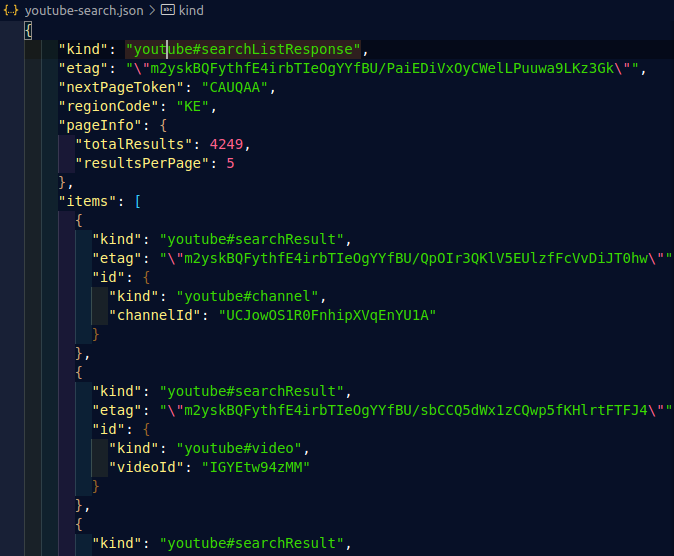

# JSON-Manipulation
*This is a repository to exercise the basics of JSON manipulation

## INDICE
---
* [JSON](#introduction)
* [ESTRUCTURA](#estrucura)
* [PRACTICA](#practica)

## ¿Que es JSON? <a name='introduction'></a>
JavaScript Object Notation. Un formato de intercambio de información entre aplicaciones.

Esto nos permite serializar objetos, arreglos, números, cadenas, booleanos y nulos.

## Estructura de JSON <a name='estructura'></a>
Es parecido a un objeto literal de JS, pero todas sus claves deben llevar comillas dobles "", (tambien es recomendable ponerlos en los valores):
```
    {
        "userId": 1,
        "firstName": "Krish",
        "lastName": "Lee",
        "phoneNumber": "123456",
        "emailAddress": "krish.lee@learningcontainer.com"
      }
```

**Dos de los métodos mas importantes** son ***parse()*** y ***stringify()***
* **parse()**
    <br>Convierte el JSON en un formato interno que el lenguaje soporta, por ejemplo:
    
* **stringify()**
<br>Por el contrario este método convierte objeto de JS a cadena de texto JSON:


## Practice <a name='practica'> </a> 
* Para ejemplo cuando ya contamos con un archivo JSON, podemos usar la función *require* para accedera el:

*app.js*
```
    const json = require('./users.json')
```
... 
Obteniendo:
<kbd><kbd>

...

Contando ya con los datos, podemos realizar distintas operaciones, segun nuestro intereses, por ejemplo si queremos obtener los número telefonicos de los usuarios podemos acceder a ellos como sigue:
```
const jsonData = require('./users.json');

// Obtención de los No. Telefonicos iterando sobre objeto users:
const getPhones = (json) => {

    for (let i = 0; i < json.users.length; i++) {
        console.log(json.users[i].phoneNumber);
    }
    return
}

console.log(getPhones(jsonData));

```

Siendo el output:


<br>

---
<br>

En otro ejemplo podemos usar el JSON XNzXri4.json en donde vemos los datos que se obtienen en un JSON tras una busqueda en youtube.<br>

El cual contiene objetos anidados en otros objetos y arrays.
Para procesarolo si por ejemplo queremos obtener los resultados y de estos solo los ID's de los videos, entonces:
```
    const newJson = require('../XNzXr1i4.json')
```
---